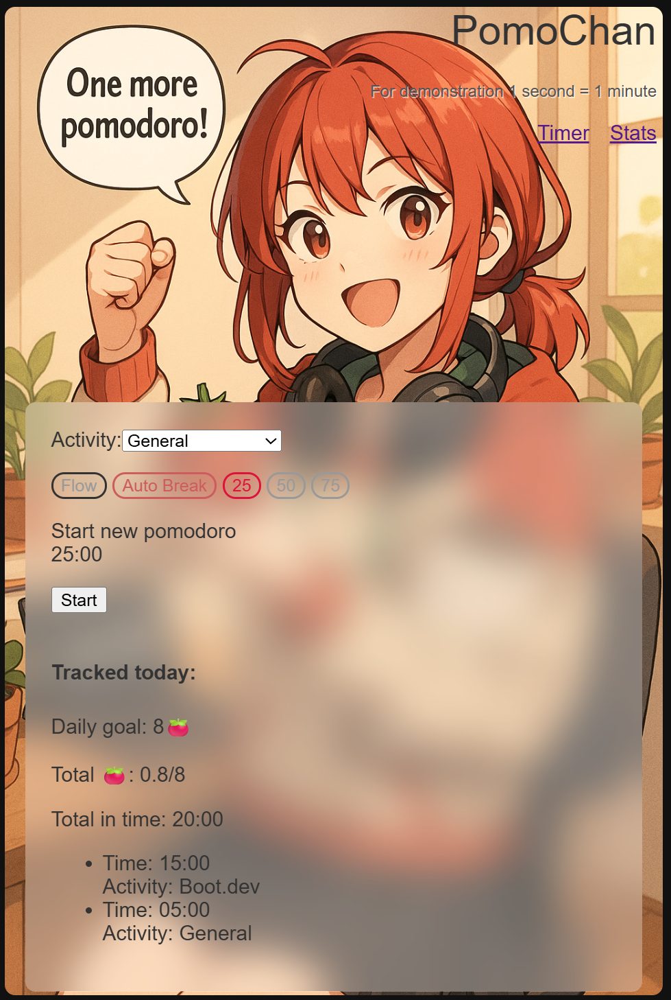

# ⏱ PomoChan - your cute focus buddy.
Not just a pomodoro timer — stay productive with flow mode, smart breaks, and insightful stats.

Real-time sync pomodoro app and stats — built with Go (Echo) and HTMX (questinable choice I know)  
**Interact from multiple devices at the same time!** 

Ever had your timer go off right when you just need 3 more minutes to finish something?
It’s frustrating — you either interrupt your flow or waste time.

Not anymore. With Flow Mode and the option to disable automatic breaks, you stay in control. Finish strong, not rushed.


## 🚀 Features

- ✅ Track complete or partial Pomodoro sessions
- ⏳ **Flow Mode** (acts as a stopwatch for distraction-free deep work)
- 🔁 **Automatic Breaks** inserted between work sessions
- 📊 View detailed statistics over selected time ranges
- 🎯 Daily goal and efficiency tracking (default: 8 Pomodoros/day)
- 📈 Interactive charts with trendlines for daily progress
- 🔄 Real-time sync of timer state across devices (via SSE)
- ⚡ (coming) Offline-first support SPA PWA
- 🗂 Categorize sessions by activity (e.g. Boot.dev, Japanese, etc.) (hardcoded for now)

## 📷 Screenshots



## 💻 Tech Stack

- **Backend:** Go + Echo
- **Frontend:** HTMX, Chart.js
- **Rendering:** Go HTML templates
- **Realtime:** Server-Sent Events (SSE)


## 📦 Running Locally

```bash
git clone https://github.com/DanilShapilov/PomoChan
cd PomoChan
go run main.go
